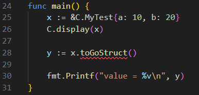

# Goal

The goal of this repository is to reproduce a gopls/vscode bug with cgo.

## Generate C++ library

__On windows with MINGW__ :

```bash
( mkdir build && cd build && cmake .. -G "MinGW Makefiles" && make )
```

## Generate go binary

```bash
go build
```

## What's wrong

In vscode, gopls indicates an error in file main.go.
It indicates a missing field or method for the type C.MyTest (in this case toGoStruct).
main.go compiles succesfully.


